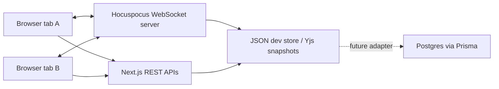

# Storyroom

**A realtime collaborative novel-writing workspace built with Next.js, TipTap, Yjs, Hocuspocus, and Prisma.**

Storyroom is a portfolio-grade multiplayer writing tool for co-authors. It combines a collaborative manuscript editor, scene organization, story-bible notes, live presence, shared cursors, scene chat, persistence, and export.


## Why This Project Matters

Most writing apps are either plain documents or private planning tools. Storyroom treats fiction writing as a multiplayer workspace:

- Co-authors can write in the same scene at the same time.
- Live presence shows who is in the room and where they are editing.
- Scene chat keeps collaboration attached to the manuscript.
- The story bible tracks canon facts, characters, places, and lore beside the draft.
- Yjs CRDT state keeps simultaneous edits safe without hand-rolled conflict logic.

This project demonstrates realtime state synchronization, editor architecture, WebSocket coordination, API design, persistence strategy, and end-to-end testing.

## Feature Highlights

- **Realtime manuscript editing** with TipTap, ProseMirror, Yjs, and Hocuspocus.
- **Live cursors and presence** using Yjs awareness.
- **Chapter and scene navigation** for novel structure.
- **Story bible panel** for characters, canon facts, places, and lore.
- **Scene chat** sent through WebSocket stateless events and persisted after broadcast.
- **Markdown export** from saved Yjs document snapshots.
- **Zero-setup local demo** with a JSON dev store.
- **Production-ready data model** with Prisma/Postgres schema and Prisma 7 Postgres adapter wiring.
- **Automated two-tab realtime test** with Playwright.

## Tech Stack

| Area | Tools |
| --- | --- |
| App | Next.js App Router, React, TypeScript |
| UI | Tailwind CSS, lucide-react, small local component primitives |
| Editor | TipTap, ProseMirror, Yjs |
| Realtime | Hocuspocus WebSocket server, Yjs awareness |
| API | Next.js route handlers, Zod validation |
| Persistence | JSON dev store, Prisma/Postgres schema |
| Testing | Vitest, Playwright |

## Quick Start

```bash
corepack pnpm install
corepack pnpm prisma:generate
corepack pnpm dev
```

Open [http://localhost:3000](http://localhost:3000), then open the same URL in a second browser tab. Type in one tab and watch the second tab update instantly.

The realtime service runs on `ws://localhost:1234`.

## Demo Script For Recruiters

1. Open Storyroom in two browser tabs.
2. Rename each tab's author in the left sidebar.
3. Type a sentence in the manuscript editor in tab one.
4. Watch the text and cursor sync live in tab two.
5. Send a scene chat message from tab two.
6. Add a canon fact in the story bible.
7. Export the novel as Markdown.

The fastest technical explanation:

> Each scene is a Yjs document. Hocuspocus handles WebSocket sync and awareness, while the app stores compact Yjs updates so the manuscript survives refreshes and reconnects.

## Architecture



More detail: [docs/ARCHITECTURE.md](docs/ARCHITECTURE.md)

## Validation

```bash
corepack pnpm lint
corepack pnpm typecheck
corepack pnpm test
corepack pnpm build
corepack pnpm test:e2e
```

The e2e test opens two Chromium tabs and verifies manuscript sync, presence, and chat.

## Optional Postgres

The default demo intentionally uses a JSON dev store so reviewers can run it immediately. The Prisma schema, config, generated client path, and Postgres adapter are included for the production persistence path.

```bash
docker compose up -d
```

Set `DATABASE_URL` from `.env.example`, then extend the repository layer behind the existing API contracts.

## Project Structure

```text
src/components/storyroom/storyroom-app.tsx   Main collaborative workspace
server/realtime.ts                           Hocuspocus WebSocket server
src/lib/store.ts                             JSON dev persistence and domain operations
src/app/api                                  Zod-validated REST API routes
prisma/schema.prisma                         Postgres data model
tests/storyroom.spec.ts                      Two-tab realtime Playwright test
```

## What I Would Build Next

- Authenticated rooms and share links.
- Comments and suggestion mode.
- Scene locks for review workflows.
- AI-assisted continuity radar from manually marked canon facts.
- Prisma-backed repository implementation for hosted deployment.
